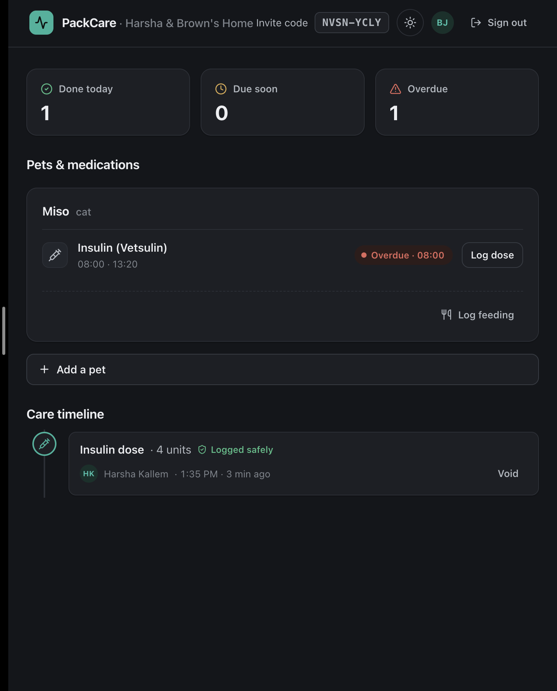
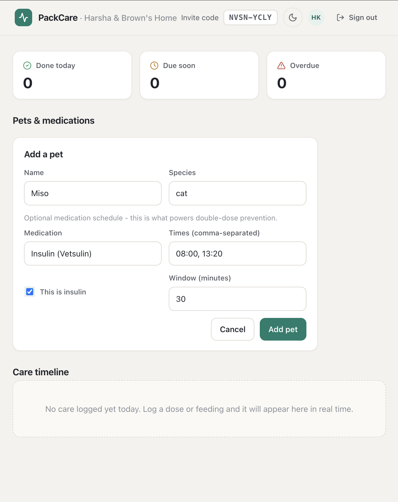
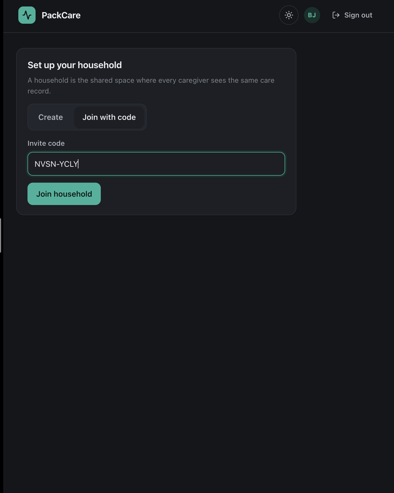
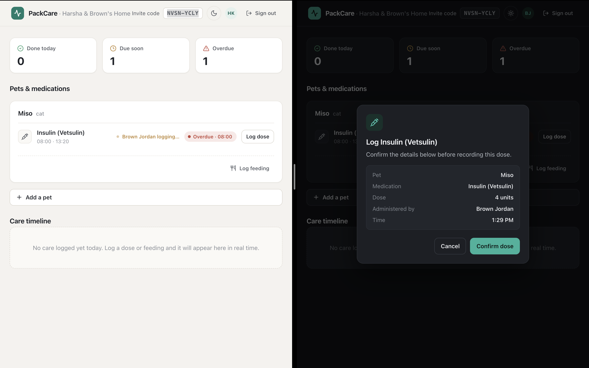
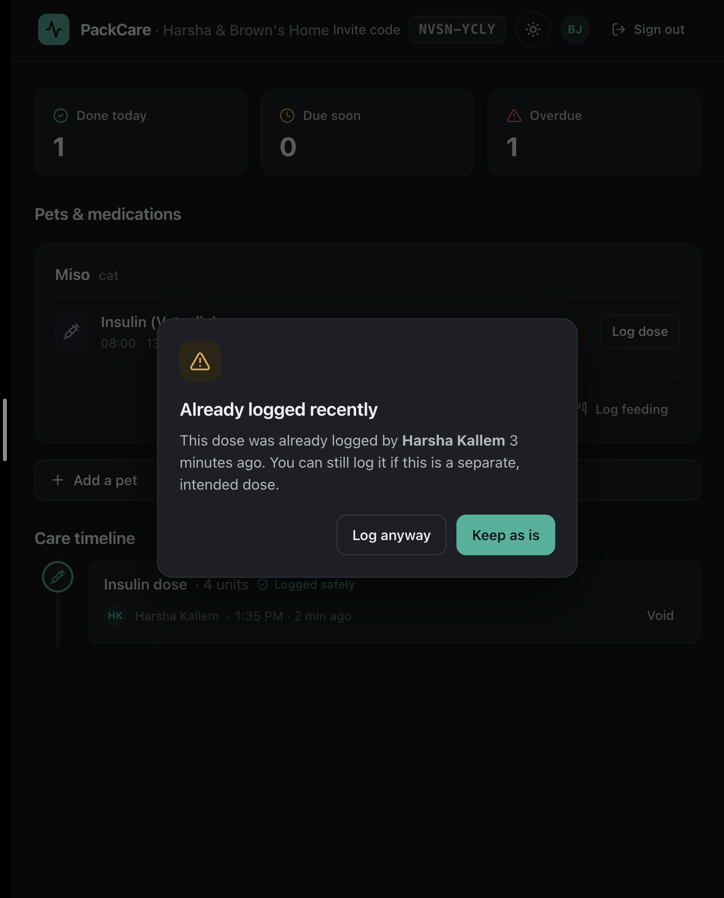
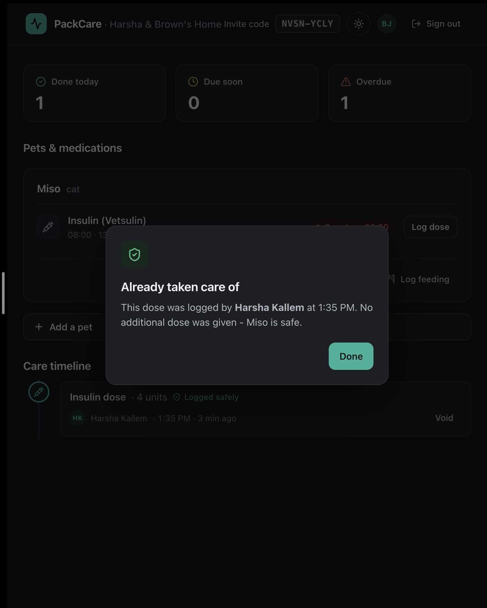

# PackCare

A real-time, multi-caregiver pet-medication tracker that prevents accidental double-dosing.

When several people share care of a pet (especially a diabetic pet on insulin), it is easy for two caregivers to give the same dose without knowing the other already did. PackCare keeps a single live record of every dose so this cannot happen.



## Features

- Shared, real-time care timeline across all caregivers
- Double-dose prevention with layered safety checks
- Live presence so you can see when someone else is about to log a dose
- Scheduled dose reminders and overdue alerts
- Google sign-in

## How it works

The screenshots below follow one household - **Harsha** and **Brown**, who share care of a diabetic cat named **Miso** on twice-daily insulin.

### 1. Set up a shared household

Harsha creates a household and adds Miso, including the insulin schedule that powers double-dose prevention.



Brown joins the same household with a simple invite code, and immediately sees the same pet and records.



### 2. Log doses in real time

When Harsha logs a dose, it appears on Brown's timeline instantly - no refresh.

<video src="./images/realtime-demo.mov" controls muted playsinline width="100%"></video>

▶ [Watch the real-time demo](./images/realtime-demo.mov)

PackCare also shows when the other caregiver is mid-action, so two people don't collide in the first place.



### 3. Prevent double-dosing

If Brown tries to give a dose Harsha already gave, PackCare first shows a soft advisory.



And if Brown proceeds anyway, the database backstop refuses outright - no duplicate is ever recorded.



## Tech Stack

- **Frontend:** React, TypeScript, Vite, Socket.IO client, React Query
- **Backend:** Node.js, Express, TypeScript, Socket.IO
- **Data:** MongoDB (replica set), Redis
- **Infra:** Docker Compose

## Architecture

Three services behind a gateway:

- **gateway** - API/BFF, authentication, and all WebSocket connections
- **care-log** - core domain and double-dose safety logic
- **scheduler** - dose reminders and overdue alerts (node-cron)
- **web** - React client

## Getting Started

```bash
cp .env.example .env
docker compose up --build
```

Then open http://localhost:5173.
